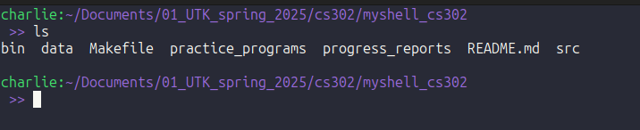
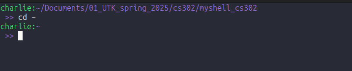
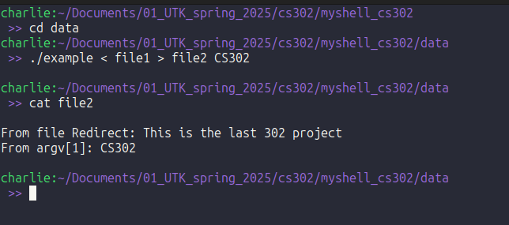
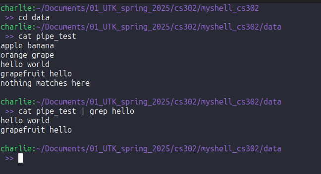

# Shell Project

## Functionality

  - This is a basic shell implementation that can run commands found in /usr/bin 
  - A few built-in commands were implemented such as cd, help, exit, and echo
  - File i/o redirection
  - piping between processes 

## Build and Run 
  
Compile the Project
  
``` Makefile
make
```

Run the program

``` Bash 
bin/myshell
```

## Testing the shell

  Here are some examples of commands that can be run in the shell. Feel free to copy these examples to test or try your own.

  ``` SHELL 
ls
```



```SHELL
cd ~
```


```SHELL
./example < file1 > file2 CS302
```


```SHELL
cat pipe_test | grep hello
```


